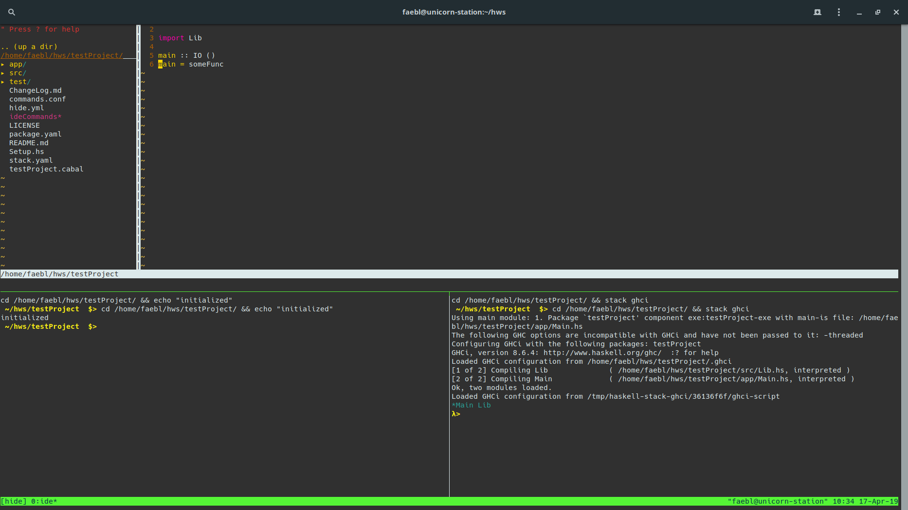
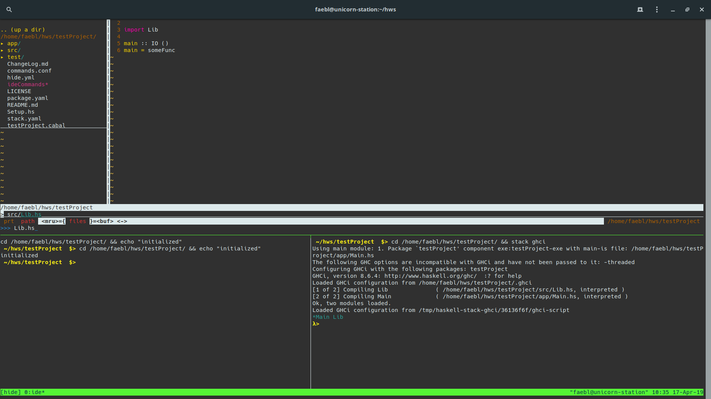
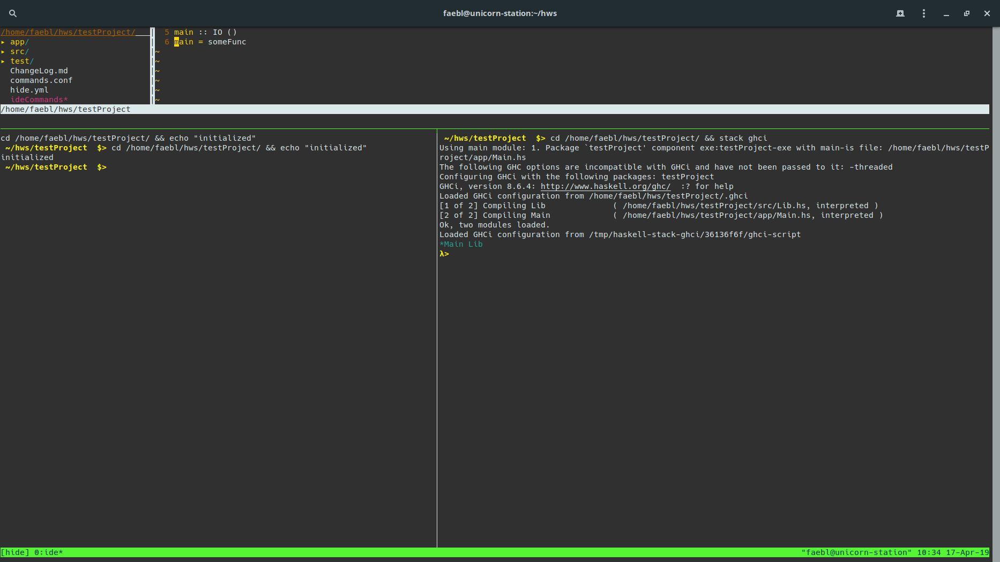
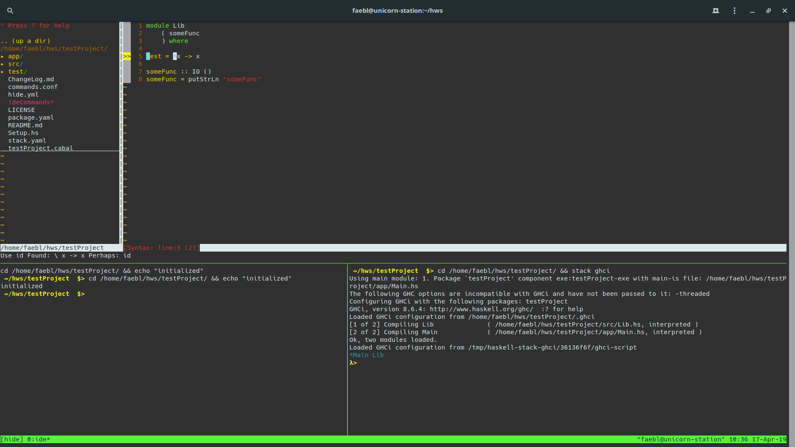
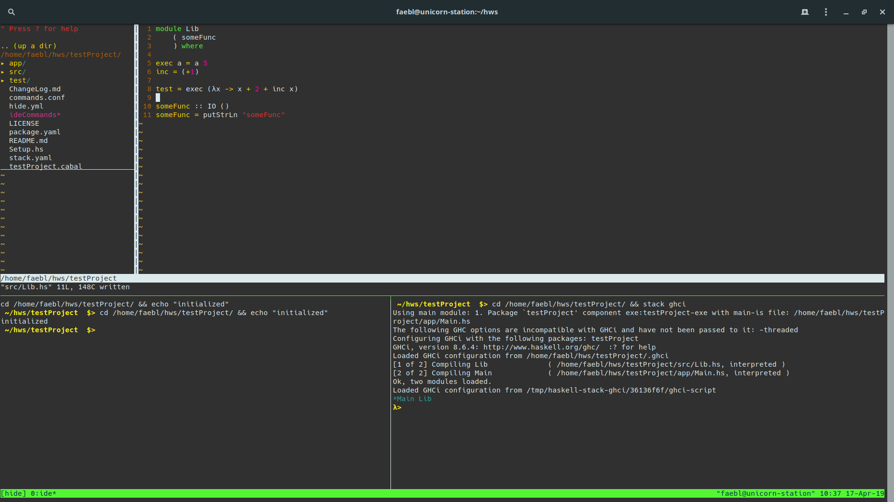

# HaskIDE
_____________
HaskIDE is a hackable,  basic, terminal based IDE, composed of tried and trusted components. Although primary built for Haskell, it is easily customized and also adjusted to other languages.

HaskIDE was built out of frustration with the installation procedures and failures of other Haskell IDEs and does not depend on fancy packages like GHC-Mod or similar stuff.
It should work on the most common Linux platforms as well as (under construction) Windows and Mac OS.
The IDE is not very feature rich (mainly because I never used most of the features of my IDEs anyway) but includes important basic functions. 
The main benefit is the simple installation procedure (no build required) and the ease of customization.

## Features
HaskIDE includes 
- a launcher to open files and folders/projects in multiple windows (multiple instances of the IDE)
- an option to name name your IDE instances
- an option to minimize a window 
- and extendible command interface
- a UI that includes
  -  VIM as an editor
  -  in editor linting info
  -  in editor build error info without ghc-mod (under construction)
  -  in editor source code search
  -  a directory/project explorer
  -  multi plane layout with an editor, a shell and a REPL
  -  intuitive keybindings for building and reloading the REPL
  -  click enabled and by-mouse-resizable panes

HaskIDE also saves your settings per project, which makes it easy to have custom build commands/IDE layouts for different projects.
As all the source code is bash and vim script (and also well commented) so you should be able to tinker with it and add new features easily.

## Installation (Linux)
Pull the git repo and run 
```sh
$ [repo]/install.sh
```
to see the settings for the installation.

The normal installation command is:
```sh
$ [repo]/install.sh -a
```

This installs all the dependencies of the IDE, along with the IDE itself, a git bash extension, a custom XCompose-Key-File for greek letters and syntax files for Cabal, Haskell and LiterateHaskell.
You can customize what to install using flags.
You can also customize where to install the IDE.
Run ```[repo]/install.sh -h``` to see your options.
The installer takes a best guess at what package manager it will use to install the dependencies.
If you have a customized setup (if you have, you will probably know) just change the variable ```$install_cmd``` in the file to the command you normally use to install packages.

## Installation (Windows)
under construction

##Installation (Mac)
being tested

## Under the hood
HaskIDE uses a combination of VIM, tmux and tmuxinator to function.

## Customizing
Everything about the IDE is customizable. You can plug in another editor (version with emacs/spacemacs still under construction), use different layouts, different procedures of project initialization or event customize it for different languages.
If you simply want to add new commands to your IDE that you can either call with ```:call RunCmd([command], [paneID on which to run])``` or add a key binding to the aforementioned command.
For a simple setup using another language than Haskell: just change the syntax files in your ```~/.vim/syntax``` folder, the build and reload commands in the ```commands.conf``` and the initializing commands for the panes in the ```hide.yml```.
Then you should be good to go ;)

For further information on what and how to customize, see the wiki (under construction).

## Credits
Thanks to all the people on stackoverflow & co for their useful posts on how to use vim- and bash script ;)

## Screenshots
Opening a new project:


Opening a file:


Searching files:


Resizing the panes:


Linting info:


Lambda Goodness:

